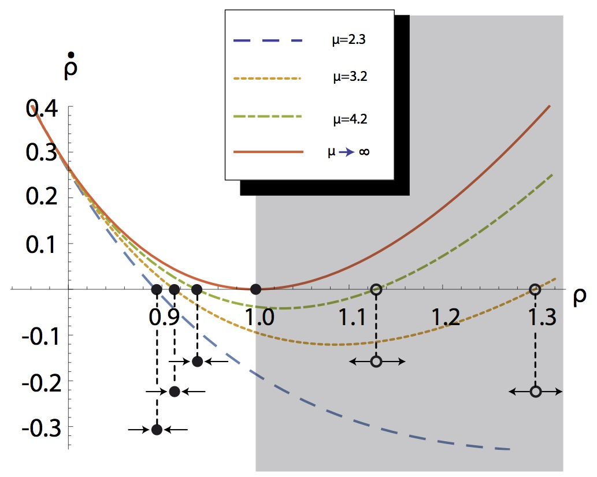
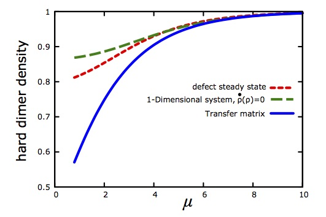

Here is a repository of the necessary files to run the mean-field calculation of void sizes for interacting 1-D particles, as implemented in the associated paper: https://journals.aps.org/prl/abstract/10.1103/PhysRevLett.115.088301

The code can be used to show the unique features of adosorption density for soft interacting particles, as shown in the attached figures:
 

The fixed points of density converge to unity in the limit of stiffness, adsorption affinity tending to infinity. This is why hard particles are constrained to purely monotonic density profiles with time (see PRL cited above). 

 

Three independent models converge to predict the steady-state density: mean-field void numerics; defect creation/annihilation with diffusion, and the thermodynamic equilibrium calculated from the transfer matrix (see https://www.pnas.org/content/110/14/5719, supplement).

That such completely independent approaches converge is a striking indication of the robustness of our approach.

For further information, or for more detailed instructions on how you might apply this code to a problem of your own, please contact me, and  I would be happy to make it more "user friendly". 
